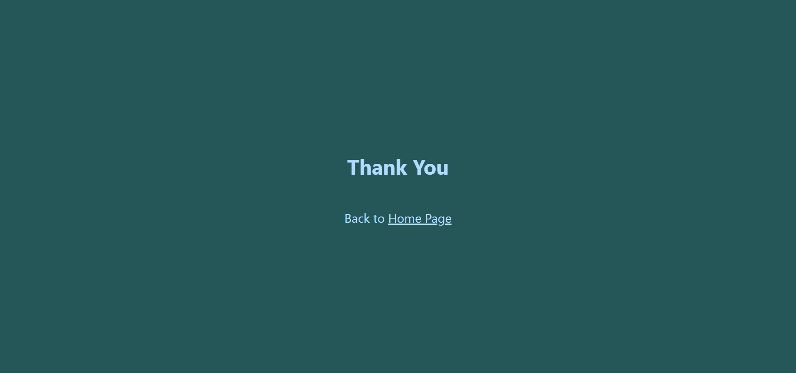

# Kemtai App exercise for NextDevs

## Screenshots
### Mobile
#### Home Page


#### Main Frame


#### Thank You Page


### Desktop
#### Home Page


#### Main Frame


#### Thank You Page


## Run Locally
```bash
git clone https://github.com/OPerel/kemtai-exercise.git
npm install
npm run start
```